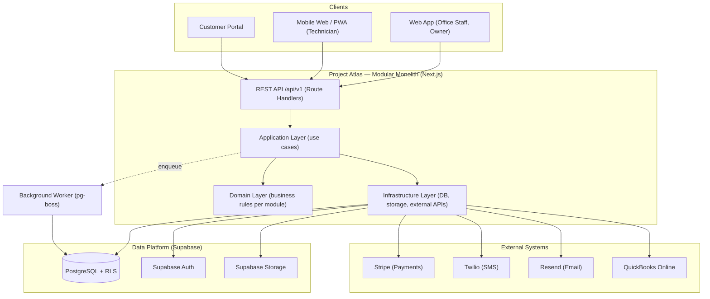

# Architecture Overview

## Summary

Project Atlas is a multi-tenant SaaS application built as a **modular monolith**: a single Next.js application, deployed as one unit, internally organized into domain modules with strict boundaries. Data lives in a single PostgreSQL database (via Supabase) with tenant isolation enforced by Row Level Security. This is deliberate — see [Architecture Principles](./architecture-principles.md) and [Product Principles](../00-overview/product-principles.md) — and is not a placeholder for "microservices later"; it is the intended architecture for the scale Atlas targets (see [Scalability Strategy](./scalability-strategy.md)).

## The four architectural views in this section

1. [System Context](./system-context.md) — Atlas and the external systems/actors around it.
2. [Container Architecture](./container-architecture.md) — the deployable units (web app, database, worker, storage) and how they communicate.
3. [Component Architecture](./component-architecture.md) — the internal module structure inside the web application.
4. [Deployment Architecture](./deployment-architecture.md) — how these containers map to actual infrastructure (Vercel, Supabase, worker host).

## High-level shape

## Why this shape

- **One deployable app** keeps deployment, observability, and transaction boundaries simple while the business is proving product-market fit. See [ADR-001](../11-adr/ADR-001-monorepo.md).
- **Strict internal module boundaries** (see [Component Architecture](./component-architecture.md)) mean the "monolith" is not a ball of mud — each domain module (Identity, CRM, Properties, Jobs, Financials, Inventory) owns its own tables and exposes its own application-layer interface, matching the domain model in [Domain Overview](../03-domain/domain-overview.md).
- **PostgreSQL is the system of record and the enforcement point for tenancy**, search, and much of what other stacks delegate to separate infrastructure. See [ADR-004](../11-adr/ADR-004-postgresql.md).
- **A single background worker process** handles anything that shouldn't block an HTTP request — notification delivery, invoice PDF generation, scheduled reminders — via a Postgres-backed queue rather than a message broker. See [ADR-016](../11-adr/ADR-016-background-jobs.md).

## Related documents

[Technology Stack](./technology-stack.md) · [Integration Architecture](./integration-architecture.md) · [Event-Driven Architecture](./event-driven-architecture.md) · [Scalability Strategy](./scalability-strategy.md) · [Security Architecture](../07-security/security-architecture.md)
