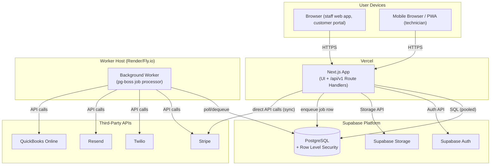

# Container Architecture

## Purpose

Shows the deployable/runnable units that make up Atlas and how they communicate. "Container" here is the C4-model sense (a deployable unit), not a Docker container specifically, though the background worker is in fact deployed as one.

## Containers

### Next.js App (Vercel)
The single deployable web application. Serves the UI (Server + Client Components) and the versioned REST API. Contains all four architectural layers (Presentation, Application, Domain, Infrastructure — see [Architecture Principles](./architecture-principles.md)). Scales horizontally via Vercel's serverless/edge functions; holds no in-process state between requests. See [Component Architecture](./component-architecture.md).

### Background Worker (Render/Fly.io)
A small, always-on Node.js process running `pg-boss`, which polls a Postgres-backed job queue table. Handles anything that must not block an HTTP response or that runs on a schedule: notification delivery, PDF generation for invoices/estimates, QuickBooks sync jobs, scheduled reminder jobs. Deployed independently of the Next.js app but from the same monorepo. See [ADR-016](../11-adr/ADR-016-background-jobs.md).

### PostgreSQL (Supabase)
The single system of record. Enforces tenant isolation via Row Level Security (see [Multi-Tenancy](../04-database/multi-tenancy.md)), full-text search, and the `pg-boss` queue tables. Accessed by both the Next.js app (via pooled connections, using Supabase's connection pooler in serverless-friendly transaction mode) and the Worker.

### Supabase Auth
Issues and verifies JWTs for authenticated sessions. The Next.js app never re-implements password hashing or session token issuance. See [ADR-006](../11-adr/ADR-006-authentication.md).

### Supabase Storage
Stores uploaded files (job photos, signed forms, invoice PDFs) as S3-compatible objects, access-controlled per Organization. See [ADR-013](../11-adr/ADR-013-file-storage.md).

## Communication patterns

- **Browser ↔ Next.js App**: HTTPS, JSON over REST (`/api/v1/`), session cookie carrying the Supabase JWT.
- **Next.js App ↔ Postgres**: pooled SQL connections via Drizzle ORM, RLS-scoped by the authenticated user's session.
- **Next.js App → Worker**: asynchronous, via inserting a row into the `pg-boss` job table within the same database transaction as the triggering business operation — this guarantees a job is never enqueued for a write that didn't actually commit.
- **Worker → Third-party APIs**: outbound only, with retries and dead-letter handling per [ADR-016](../11-adr/ADR-016-background-jobs.md).
- **Next.js App → Stripe (synchronous path)**: certain payment operations (e.g., capturing a card-present payment while the customer is present) call Stripe synchronously within the request for immediate confirmation; everything else (webhooks, reconciliation) is asynchronous via the Worker.

## Why not more containers

No API gateway, no separate BFF (backend-for-frontend), no separate auth service, no separate search service. Each would add an operational surface without a scale justification at launch — see [Architecture Principles](./architecture-principles.md), principle 4.
