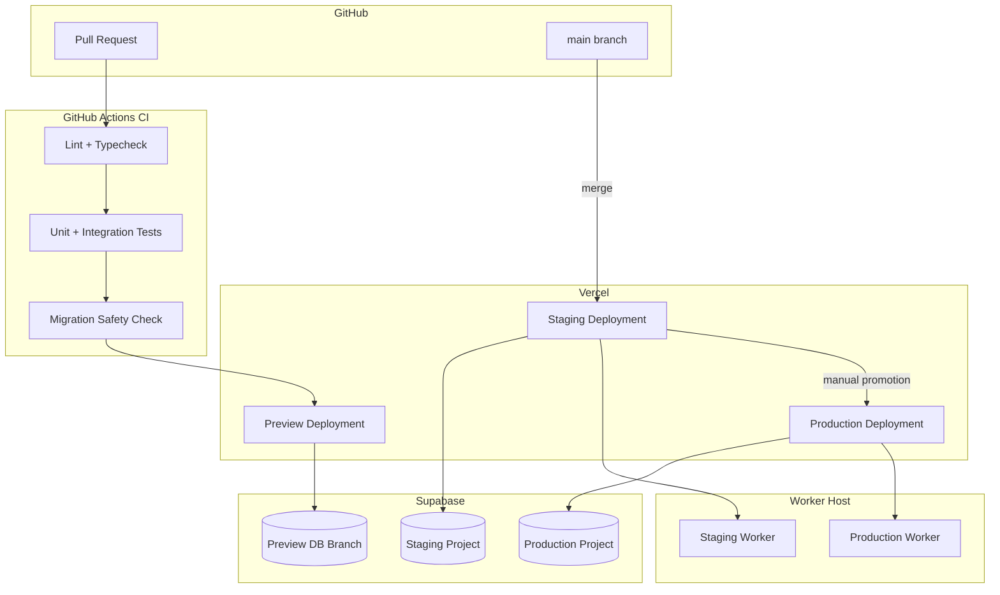

# Deployment Architecture

## Environments

Atlas runs three persistent environments plus ephemeral PR previews — see [Environment Management](../10-devops/environment-management.md) for full detail.

| Environment | Purpose | Database |
|---|---|---|
| Local | Developer machines | Local Supabase (Docker) or a dedicated dev Supabase project |
| Preview | One per open pull request | Ephemeral Supabase branch database |
| Staging | Pre-production validation | Dedicated Supabase project, production-like data volume |
| Production | Live customer traffic | Dedicated Supabase project, encrypted backups |

## Deployment flow

1. Every pull request triggers CI (lint, type-check, unit/integration tests, migration safety check — see [CI/CD](../10-devops/ci-cd.md)) and a Vercel Preview Deployment against an ephemeral Supabase database branch, so reviewers can click through real functionality.
2. Merging to `main` deploys to **Staging** automatically, including running any pending database migrations against the Staging Supabase project. See [Database Deployment](../10-devops/database-deployment.md).
3. Promotion to **Production** is a deliberate, manual step (see [Deployment](../10-devops/deployment.md)) — never automatic on merge — given the financial and multi-tenant data at stake.
4. The Background Worker is deployed as its own artifact from the same monorepo, versioned and deployed alongside the web app for the same environment, never independently out of sync with the schema it depends on.

## Network and access boundaries

- The Next.js app and the Worker connect to Postgres over TLS via Supabase's connection pooler (transaction-mode pooling for the serverless Next.js app; session-mode or direct connection for the long-running Worker where needed for `LISTEN/NOTIFY`).
- No component other than the Next.js app and the Worker has direct database credentials; the browser never talks to Postgres directly.
- Supabase Storage access from the browser (e.g., direct upload of job photos) uses short-lived, scoped signed URLs issued by the Next.js app, not long-lived credentials. See [Data Protection](../07-security/data-protection.md).

## Scaling model

- The Next.js app scales horizontally and statelessly via Vercel's serverless functions — no sticky sessions, no in-memory state that must survive across requests.
- The Worker scales by increasing `pg-boss` concurrency/queue count on a single or small number of persistent instances; it is not expected to need horizontal fleet scaling at launch volumes. See [Scalability Strategy](./scalability-strategy.md).
- PostgreSQL scales vertically (Supabase compute tier) initially, with read replicas considered only when reporting/analytics load demonstrably contends with operational write load.

## Rollback

Deployments are rolled back via Vercel's instant rollback to a previous deployment. Database migrations are additive-first and backward-compatible for at least one release (see [Migrations](../04-database/migrations.md)) specifically so an application rollback never requires a corresponding destructive schema rollback.
