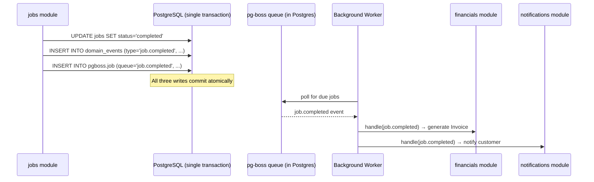

# Event-Driven Architecture

## Scope of "event-driven" in Atlas

Atlas is **not** built on event sourcing and does not use a message broker (Kafka, RabbitMQ, SNS/SQS). Events are a narrow, deliberate mechanism for two things:

1. **Decoupling cross-module reactions** inside the modular monolith (e.g., a Job being completed should trigger invoice generation and a customer notification, without the `jobs` module needing to know how invoicing or notifications work).
2. **Producing the durable Audit Event history** required by [Product Principles](../00-overview/product-principles.md) and [Audit Events](../03-domain/audit-events.md).

See [ADR-011: Event History](../11-adr/ADR-011-event-history.md) for the full rationale and alternatives considered.

## Mechanism

- A domain module, within the same database transaction as its state change, inserts a row into an internal `domain_events` table (event type, payload, organization_id, occurred_at).
- The same transaction (or, for side effects that must not block the response, a subsequent Worker-processed row in the `pg-boss` job queue enqueued from a transactional outbox pattern) is used to guarantee **at-least-once** delivery of the event to interested modules — an event is never lost because the enqueue happens atomically with the state change that produced it.
- Consumers are registered handlers within the modular monolith (in-process function calls triggered by the Worker picking up the queued job), not a separate pub/sub broker.

## Event catalog (launch scope)

| Event | Producer module | Consumers | Effect |
|---|---|---|---|
| `job.dispatched` | `jobs` | `notifications` | SMS/email to Technician and Customer |
| `job.completed` | `jobs` | `financials`, `notifications`, `analytics` | Generate Invoice, notify Customer, update reporting aggregates |
| `estimate.approved` | `financials` | `jobs`, `notifications` | Unblock Job execution if gated on approval, notify staff |
| `invoice.finalized` | `financials` | `notifications` | Send Invoice to Customer |
| `payment.received` | `financials` | `notifications`, `analytics` | Send receipt, update reporting |
| Every entity create/update/delete | all modules | `audit` (synchronous, same transaction) | Persist Audit Event — see note below |

## Audit Events are not asynchronous

Unlike the cross-module reaction events above, [Audit Events](../03-domain/audit-events.md) are written **synchronously, in the same transaction** as the state change they record — never queued, never eventually-consistent, because an audit record that might not exist yet defeats its purpose. See [Audit Logging](../04-database/audit-logging.md).

## What this architecture explicitly avoids

- **Full event sourcing** (rebuilding entity state by replaying events) — Atlas's relational tables are always the current-state source of truth; events are a notification/history mechanism layered on top, not the persistence model itself.
- **A message broker** — Postgres itself is the durable queue (`pg-boss`), consistent with [Architecture Principles](./architecture-principles.md), principle 4.
- **Cross-Organization event fan-out** — all domain events are scoped to a single `organization_id` and are never broadcast across tenants.
