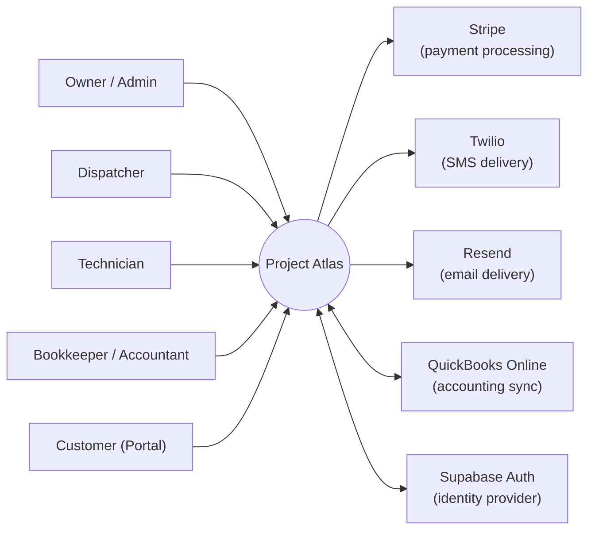

# System Context

## Purpose

Shows Atlas as a black box and every human actor and external system that interacts with it at launch scope (Phase 1–2). See [Product Scope](../01-product/product-scope.md).

## Actors

| Actor | Relationship to Atlas | Detail |
|---|---|---|
| Owner / Admin | Full-access staff user of an Organization | [User Personas](../00-overview/user-personas.md) |
| Dispatcher | Scheduling/dispatch-focused staff user | [Scheduling PRD](../06-modules/scheduling-prd.md) |
| Technician | Field-execution staff user, primarily mobile | [Mobile PRD](../06-modules/mobile-prd.md) |
| Bookkeeper / Accountant | Financial-focused staff user | [Invoicing PRD](../06-modules/invoicing-prd.md) |
| Customer | External party via Customer Portal, no staff Membership | [Customer Portal PRD](../06-modules/customer-portal-prd.md) |

## External systems (launch scope)

| System | Direction | Purpose | Detail |
|---|---|---|---|
| Stripe | Atlas → Stripe | Payment capture, card tokenization | [Payments PRD](../06-modules/payments-prd.md), [ADR-018](../11-adr/ADR-018-payments.md) |
| Twilio | Atlas → Twilio | SMS notifications | [Notifications PRD](../06-modules/notifications-prd.md) |
| Resend | Atlas → Resend | Transactional email | [Notifications PRD](../06-modules/notifications-prd.md) |
| QuickBooks Online | Bidirectional | Accounting export/sync | [Integrations PRD](../06-modules/integrations-prd.md) |
| Supabase Auth | Bidirectional | Authentication, session issuance | [Authentication](../05-api/authentication.md), [ADR-006](../11-adr/ADR-006-authentication.md) |

## Out of scope for this context diagram

Future-phase external systems (Supplier Marketplace APIs, Manufacturer partner APIs, lending partner APIs — see [Roadmap Phases 4–6](../13-roadmap/implementation-roadmap.md)) are intentionally excluded; they are documented in their respective module PRDs and will be added to this diagram when their Roadmap Phase begins.
