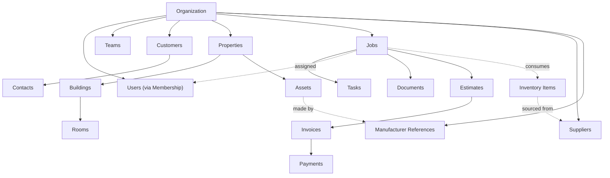

# Domain Overview

## Purpose

This document is the map of the Project Atlas domain model. Every entity below has its own document in this directory with attributes, relationships, and business rules; this document establishes the overall hierarchy, the configuration-driven trade-agnostic pattern, and the rules that apply across entities.

## Core hierarchy

This mirrors the hierarchy mandated in the product brief: Organization owns Users, Teams, Customers (→ Contacts), Properties (→ Buildings → Rooms, and → Assets), Jobs (→ Tasks, Technicians, Documents, Parts, Payments), Suppliers, and Manufacturers.

## Entity index

| Entity | Document | Owned by |
|---|---|---|
| Organization | [organization.md](./organization.md) | — (tenant root) |
| Users | [users.md](./users.md) | Organization (via Membership) |
| Roles | [roles.md](./roles.md) | Organization |
| Permissions | [permissions.md](./permissions.md) | Platform-defined, assigned via Roles |
| Customers | [customers.md](./customers.md) | Organization |
| Contacts | [contacts.md](./contacts.md) | Customer |
| Properties | [properties.md](./properties.md) | Organization |
| Buildings | [buildings.md](./buildings.md) | Property |
| Rooms | [rooms.md](./rooms.md) | Building |
| Assets | [assets.md](./assets.md) | Property (optionally Building/Room) |
| Jobs | [jobs.md](./jobs.md) | Organization |
| Tasks | [tasks.md](./tasks.md) | Job |
| Technicians | [technicians.md](./technicians.md) | Organization (a User role) |
| Scheduling | [scheduling.md](./scheduling.md) | Job |
| Dispatch | [dispatch.md](./dispatch.md) | Job |
| Documents | [documents.md](./documents.md) | Job / Property / Asset |
| Estimates | [estimates.md](./estimates.md) | Job |
| Invoices | [invoices.md](./invoices.md) | Job / Estimate |
| Payments | [payments.md](./payments.md) | Invoice |
| Inventory | [inventory.md](./inventory.md) | Organization |
| Suppliers | [suppliers.md](./suppliers.md) | Organization |
| Manufacturers | [manufacturers.md](./manufacturers.md) | Platform-shared reference data |
| Warranties | [warranties.md](./warranties.md) | Asset |
| Compliance | [compliance.md](./compliance.md) | Job / Asset / Organization |
| Marketplace | [marketplace.md](./marketplace.md) | Organization ↔ Supplier (future) |
| Analytics | [analytics.md](./analytics.md) | Organization (derived/read-only) |
| Audit Events | [audit-events.md](./audit-events.md) | Organization (system-generated) |

## The trade-agnostic configuration pattern

Rather than modeling Plumbing, HVAC, and Electrical as separate schemas or code paths, the domain uses five configuration entities, each scoped per Organization (with platform-provided defaults an Organization can extend):

| Configuration entity | Purpose | Referenced by |
|---|---|---|
| `trade_types` | The discipline a Job/Technician/Asset relates to (Plumbing, HVAC, Electrical, ...) | Jobs, Technicians (skills), Assets |
| `asset_types` | The category of equipment (e.g., "Tankless Water Heater", "Split System Condenser", "200A Panel"), scoped to a trade type | Assets |
| `job_types` | The kind of work (e.g., "Drain Cleaning", "AC Repair", "Panel Upgrade"), each with a default checklist/form and estimated duration | Jobs |
| `service_categories` | A grouping above Job Type used for pricing/reporting (e.g., "Repair", "Installation", "Maintenance") | Jobs, Price Books |
| `checklist_templates` / `form_definitions` | The structured steps/fields captured during a Job, associated with a Job Type | Jobs, Tasks |

See [ADR-009: Domain Modules over Trade Verticals](../11-adr/ADR-009-domain-modules.md) for the architectural rationale, and [Jobs](./jobs.md) for how `job_types` drives checklist/form selection.

## Cross-cutting rules that apply to every entity

1. **Tenant ownership**: every Organization-owned entity carries `organization_id` directly, or is unambiguously scoped through a parent that does (e.g., a Contact through its Customer). See [Multi-Tenancy](../04-database/multi-tenancy.md).
2. **Auditability**: every create/update/delete of a tenant-owned entity produces an [Audit Event](./audit-events.md).
3. **Soft deletion where recovery matters**: Customers, Properties, Assets, Jobs, Estimates, and Invoices support soft deletion (`deleted_at`); purely operational/log data (Audit Events, Documents metadata) does not need soft deletion because it is either already immutable or trivially re-creatable. See [Soft Deletion](../04-database/soft-deletion.md).
4. **Immutability where money is involved**: Invoices and Payments, once finalized, are never destructively edited. See [Invoices](./invoices.md), [Payments](./payments.md).
5. **UUIDs, timestamps**: every entity uses a UUID primary key and `created_at`/`updated_at` (UTC) — see [Primary Keys](../04-database/primary-keys.md).
