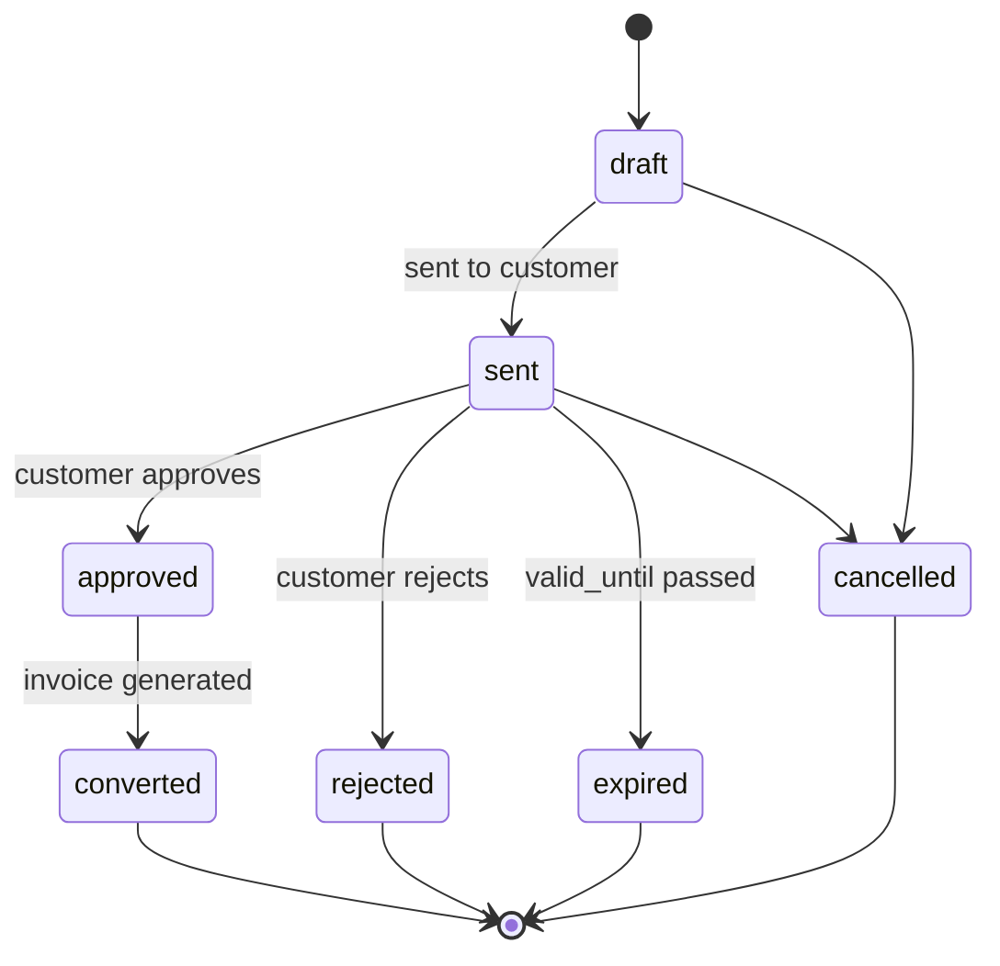

# Estimates

## Purpose

An Estimate is a priced proposal for work, presented to a Customer for approval before the associated work is authorized (or before *additional* work beyond an original scope is authorized). Estimates are the mechanism by which Atlas ensures a Customer approves cost before it's incurred.

## Key attributes

- `estimate_number` (Organization-scoped, sequential).
- `job_id` (the Job the Estimate is for), `customer_id`, `contact_id` (who it's presented to).
- `status` — see State Machine below.
- `line_items` (see below), `subtotal`, `tax_total`, `total` — all computed from line items, never entered as an independent total.
- `valid_until` (expiration date).
- `approved_at`, `approved_by_contact_id` or `approved_by_user_id` (in-person capture by staff on the Customer's behalf, with signature Document).

## Estimate Line Items

- `description`, `quantity`, `unit_price`, `inventory_item_id` (optional, if the line corresponds to a stocked part — see [Inventory](./inventory.md)), `line_total` (computed).

## Relationships

- **Belongs to** one [Job](./jobs.md).
- **Has many** Estimate Line Items.
- **Produces** an [Invoice](./invoices.md) when approved and the work is completed.
- **May reference** [Inventory Items](./inventory.md) per line.

## Business rules

1. `total` is always derived from summing line items plus tax; it is never a manually entered field, preventing estimate/invoice mismatches.
2. Once `sent`, an Estimate's line items are immutable — a change requires creating a new Estimate version (linked to the original) rather than editing in place, so the Customer's approval always corresponds to exactly what they saw.
3. Multiple Estimates can exist for the same Job (e.g., a "good/better/best" set); at most one may be in `approved` status driving the Job's billed scope at a time.
4. An expired (`valid_until` passed) Estimate cannot be approved; the Customer must be presented a refreshed Estimate, since pricing (part costs, labor rates) may have changed.

## State machine

## Data requirements

`estimates` (`organization_id`, `job_id`, `estimate_number`, `status`, totals, `valid_until`, `approved_at`, approver reference, `deleted_at`, timestamps), `estimate_line_items` (`estimate_id`, `description`, `quantity`, `unit_price`, `inventory_item_id`, `line_total`).

## API requirements

CRUD (create/update restricted to `draft`), send, approve, reject, and convert-to-invoice actions as explicit endpoints (not generic PATCH), enforcing the state machine. See [Estimates PRD](../06-modules/estimates-prd.md).

## Permission requirements

Technician: create/send/manage Estimates on assigned Jobs. Dispatcher: read-only. Accountant/Admin/Owner: full access.

## Related documents

[Estimates PRD](../06-modules/estimates-prd.md) · [Invoices](./invoices.md) · [Jobs](./jobs.md) · [Inventory](./inventory.md)
