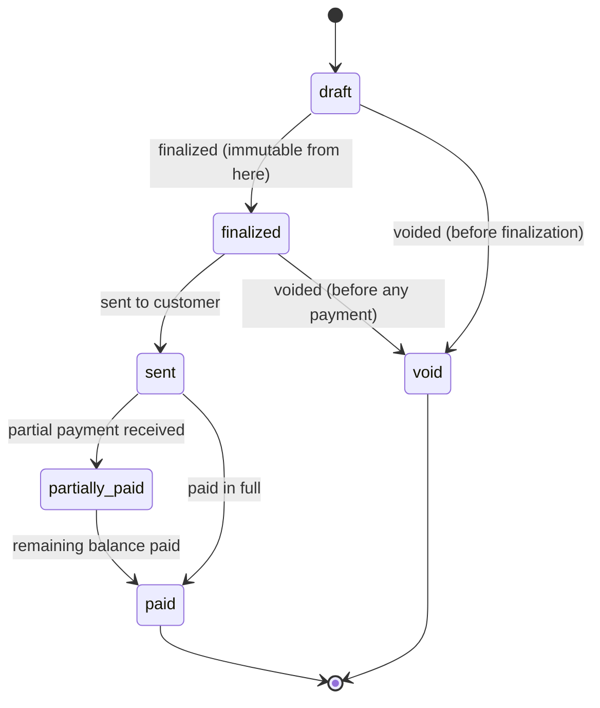

# Invoices

## Purpose

An Invoice is a finalized bill for completed work, generated from a [Job](./jobs.md) (typically from an approved [Estimate](./estimates.md), sometimes directly from ad hoc line items for simple jobs). Once finalized, an Invoice is **immutable** — this is a binding rule across the entire platform. See [Product Principles](../00-overview/product-principles.md), principle 7.

## Key attributes

- `invoice_number` (Organization-scoped, sequential, gapless within an Organization for accounting defensibility).
- `job_id`, `customer_id`, `estimate_id` (nullable, if generated from one).
- `status` — see State Machine below.
- `line_items`, `subtotal`, `tax_total`, `total`, `amount_paid` (derived from linked [Payments](./payments.md)), `balance_due` (computed: `total - amount_paid`).
- `due_date`, `finalized_at`, `sent_at`.

## Relationships

- **Belongs to** one [Job](./jobs.md), optionally one [Estimate](./estimates.md).
- **Has many** Invoice Line Items (structurally identical pattern to Estimate Line Items).
- **Has many** [Payments](./payments.md).

## Business rules

1. **Immutability**: once an Invoice transitions to `finalized`, its line items, totals, `customer_id`, and `job_id` can never be edited. Corrections are made via a **Credit Note** (a linked, signed-negative adjustment record) or a **Void** (only permitted before any Payment has been applied) — never by mutating the finalized row. See [Invoicing PRD](../06-modules/invoicing-prd.md) for the Credit Note entity detail.
2. `amount_paid` and `balance_due` are always computed from the sum of linked, non-refunded [Payments](./payments.md) — never stored as an independently editable field, to prevent drift between recorded payments and the displayed balance.
3. An Invoice cannot be finalized while its parent Job is not yet `completed` (see [Jobs](./jobs.md), State Machine) — you cannot bill for work not yet done, except for deposit/progress invoices, which are modeled as a distinct, explicitly deposit-flagged Invoice type in [Invoicing PRD](../06-modules/invoicing-prd.md).
4. `invoice_number` sequencing is per-Organization and gap-free for finalized Invoices (a voided draft does not consume a number visibly, but a voided *finalized* Invoice keeps its number and is marked void, never reused) — this matches standard accounting/audit expectations.
5. Overdue status is **computed** (`status = 'sent' AND due_date < now() AND balance_due > 0`), not a stored state the system must remember to transition into.

## State machine

## Data requirements

`invoices` (`organization_id`, `job_id`, `estimate_id`, `invoice_number`, `status`, totals, `due_date`, `finalized_at`, `sent_at`, timestamps — note: **no `deleted_at`**, Invoices are never soft-deleted, only voided, per [Soft Deletion](../04-database/soft-deletion.md)), `invoice_line_items`, `credit_notes` (`invoice_id`, reason, amount, line items, `issued_at`).

## API requirements

CRUD restricted to `draft`; explicit finalize/send/void/credit-note endpoints. See [Invoicing PRD](../06-modules/invoicing-prd.md).

## Permission requirements

Technician: create draft Invoices on assigned/completed Jobs (finalization may require Accountant/Admin approval depending on Organization settings — see [Invoicing PRD](../06-modules/invoicing-prd.md)). Accountant/Admin/Owner: full access including void/credit note. Dispatcher: read-only.

## Related documents

[Invoicing PRD](../06-modules/invoicing-prd.md) · [Estimates](./estimates.md) · [Payments](./payments.md) · [ADR-018: Payments](../11-adr/ADR-018-payments.md)
