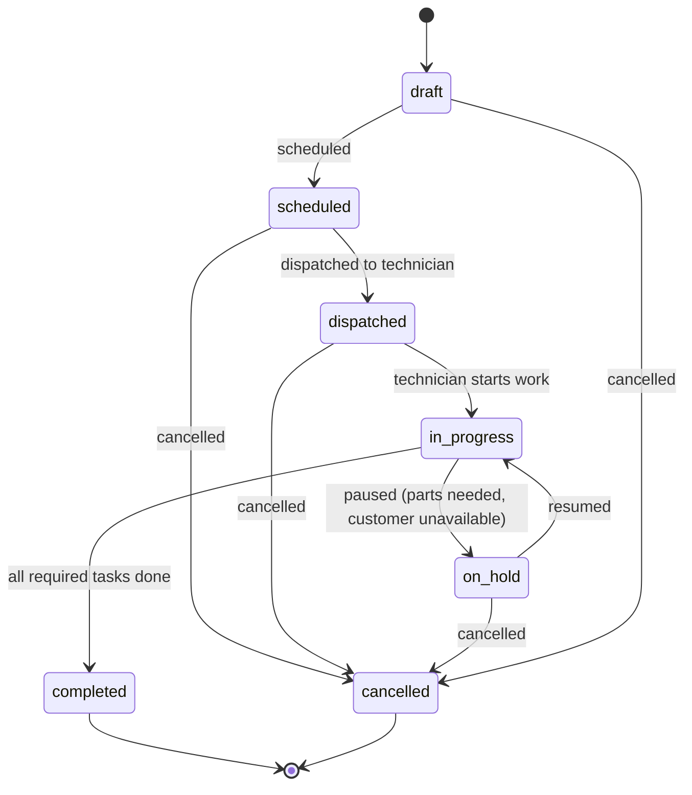

# Jobs

## Purpose

A Job is a discrete unit of work performed for a Customer, almost always at a Property, optionally against specific Assets. The Job is the central transactional entity of Core Operations — it is what gets scheduled, dispatched, executed, and billed. See [Domain Overview](./domain-overview.md).

## Key attributes

- `job_number` (Organization-scoped, human-readable, sequential).
- `job_type_id` — references the `job_types` configuration entity, which determines default checklist/form and estimated duration. See [Domain Overview](./domain-overview.md#the-trade-agnostic-configuration-pattern).
- `service_category_id` (e.g., Repair, Installation, Maintenance) — used for pricing and reporting rollups.
- `status` — see State Machine below.
- `priority` — `normal`, `urgent`, `emergency` (affects scheduling display and SLA-style notification timing).
- `customer_id`, `property_id` (required — see Business Rules), `contact_id` (optional, the specific on-site Contact), `asset_ids` (zero or more linked Assets).
- Description/summary, staff-entered diagnostic notes.
- Source: `phone`, `portal`, `repeat_visit`, `marketplace` (future).

## Relationships

- **Belongs to** one [Organization](./organization.md), one [Customer](./customers.md), one [Property](./properties.md).
- **References** zero or more [Assets](./assets.md).
- **Has many** [Tasks](./tasks.md) (checklist/form items).
- **Has many** [Technician](./technicians.md) assignments (`job_assignments`).
- **Has many** [Documents](./documents.md) (photos, signed forms).
- **Has many** [Estimates](./estimates.md), which in turn produce [Invoices](./invoices.md) and [Payments](./payments.md).
- **Consumes** [Inventory Items](./inventory.md) via `job_parts` records.

## Business rules

1. A Job always has a `property_id`. For rare non-address work (e.g., shop time, a warranty call routed through the manufacturer without a specific property), the Organization has a designated internal placeholder Property so Job history remains uniformly Property-attributable — see [Properties](./properties.md), Business Rules.
2. A Job's `job_type_id` determines its default Task checklist at creation; staff can add ad hoc Tasks but cannot remove Tasks that are marked required by the Job Type's template without an documented override reason (captured for compliance — see [Compliance](./compliance.md)).
3. A Job cannot be marked `completed` while it has any required Task incomplete, or while it has a pending (not yet approved/rejected) Estimate that gates completion — the specific gating rule is configurable per Job Type (see [Jobs PRD](../06-modules/jobs-prd.md)).
4. Once `completed`, a Job's core facts (Property, Assets, completion timestamp) are immutable; corrections go through a documented amendment, never a silent edit, to preserve the integrity of Property/Asset history.
5. Job cancellation requires a reason code, retained for reporting (why jobs fall through).

## State machine

`completed` and `cancelled` are terminal states; no transition out of them is permitted (see [Acceptance Criteria](../01-product/acceptance-criteria.md), Job state machine integrity).

## Data requirements

`jobs` table: `organization_id`, `job_number`, `job_type_id`, `service_category_id`, `status`, `priority`, `customer_id`, `property_id`, `contact_id`, description fields, `source`, `deleted_at`, timestamps. `job_assets` (join table), `job_assignments` (join to Users acting as Technicians), `job_status_history` (append-only transition log feeding [Audit Events](./audit-events.md)).

## API requirements

Full CRUD, status-transition endpoints (not raw field PATCH for `status`, to enforce the state machine server-side), and a Property/Asset-scoped history read. See [Jobs PRD](../06-modules/jobs-prd.md).

## Permission requirements

Dispatcher/Admin/Owner: full read/write across the Organization. Technician: read/write limited to assigned Jobs (`jobs:write_assigned`). Accountant: read-only. See [Permissions](./permissions.md).

## Related documents

[Jobs PRD](../06-modules/jobs-prd.md) · [Tasks](./tasks.md) · [Scheduling](./scheduling.md) · [Dispatch](./dispatch.md) · [Estimates](./estimates.md)
