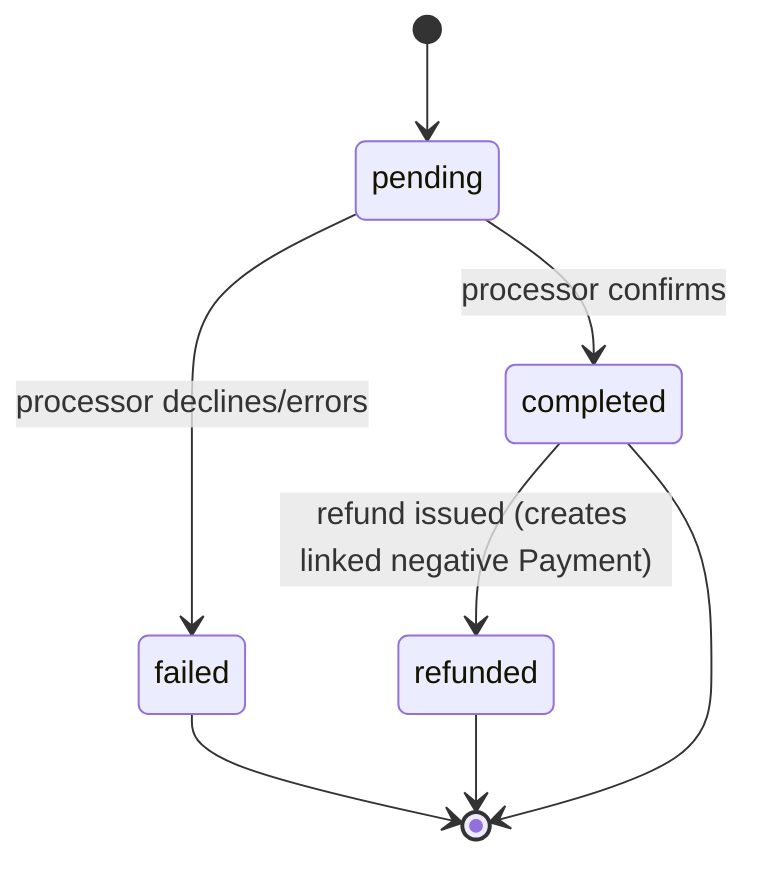

# Payments

## Purpose

A Payment is a recorded transfer of funds from a Customer against one or more [Invoices](./invoices.md). Payments are append-only records — Atlas never edits a recorded Payment, only records new Payments (including refunds as negative/linked records).

## Key attributes

- `invoice_id`, `amount`, `method` (`card`, `ach`, `cash`, `check`, `other`), `status` — see State Machine below.
- `processor` (e.g., `stripe`), `processor_reference_id` (external charge/transaction ID, for reconciliation — see [ADR-018](../11-adr/ADR-018-payments.md)).
- `captured_by_user_id` (for in-person capture) or `initiated_by` (`customer_portal` for self-serve online payment).
- `idempotency_key` — every Payment creation request carries one, enforced unique, to guarantee a network retry never double-charges. See [Acceptance Criteria](../01-product/acceptance-criteria.md), idempotent payment capture.

## Relationships

- **Belongs to** one [Invoice](./invoices.md) (an Invoice may have several Payments — partial payments over time).
- **Processed via** Stripe for card/ACH payments (see [Integration Architecture](../02-architecture/integration-architecture.md)).

## Business rules

1. Atlas **never stores raw card data**; all card capture is tokenized through Stripe's client-side SDK / Stripe Terminal (for card-present), and Atlas only stores the resulting `processor_reference_id` and non-sensitive metadata (last 4 digits, card brand) returned by Stripe. See [Data Protection](../07-security/data-protection.md).
2. A Payment is recorded only after the processor confirms success; a failed/declined attempt is logged (`status = failed`) but does not affect the Invoice's `amount_paid`.
3. Refunds are modeled as a new Payment record with a negative amount and a `refund_of_payment_id` reference — never as a deletion or mutation of the original Payment, preserving a complete, auditable money-movement trail.
4. The sum of non-failed Payments (including negative refund records) against an Invoice can never cause `amount_paid` to exceed the Invoice `total` — enforced at the application layer at capture time and verified by a database check.
5. Cash/check Payments are manually recorded by staff and carry no `processor_reference_id`, but are otherwise subject to the same immutability and refund-via-new-record rules.

## State machine

## Data requirements

`payments` (`organization_id`, `invoice_id`, `amount`, `method`, `status`, `processor`, `processor_reference_id`, `idempotency_key` unique, `captured_by_user_id`, `refund_of_payment_id` nullable, timestamps — no `deleted_at`, no `updated_at` beyond `status` transition timestamps, since Payments are append-only).

## API requirements

Create (capture) endpoint requiring an idempotency key; refund endpoint (Accountant/Admin/Owner only); read endpoints scoped to Invoice/Job/Customer. See [Payments PRD](../06-modules/payments-prd.md), [Payments API conventions](../05-api/api-overview.md).

## Permission requirements

Technician: capture payments on assigned/completed Jobs only. Accountant/Admin/Owner: full access including refunds. Dispatcher: read-only.

## Related documents

[Payments PRD](../06-modules/payments-prd.md) · [Invoices](./invoices.md) · [ADR-018: Payments](../11-adr/ADR-018-payments.md) · [Data Protection](../07-security/data-protection.md)
