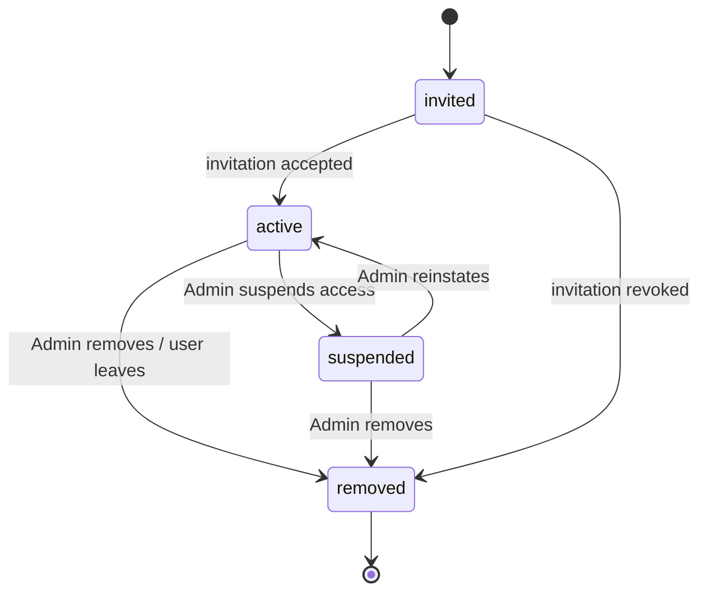

# Users

## Purpose

A User is a single, platform-wide identity (one row per human, authenticated via Supabase Auth) that gains access to one or more [Organizations](./organization.md) through a **Membership**. Users are never modeled per-Organization — this avoids duplicate identities for people who work with (e.g., bookkeepers, consultants) more than one Organization. See [Terminology](../00-overview/terminology.md).

## Key attributes

- Identity: email (unique platform-wide, used for authentication), full name, phone, avatar.
- Authentication is delegated to Supabase Auth — Atlas does not store password hashes itself. See [ADR-006](../11-adr/ADR-006-authentication.md).
- Global preferences: default notification channel, locale.

## Membership

A **Membership** is the join entity between a User and an Organization, and is where all Organization-scoped attributes live:

- `organization_id`, `user_id`, one or more `role_id` references (see [Roles](./roles.md)).
- Status: `invited`, `active`, `suspended`, `removed`.
- Organization-scoped attributes: job title/display role (e.g., "Lead Technician"), Team assignment(s).

A User with no active Membership in any Organization can still authenticate but has no accessible tenant data — the API surfaces nothing until at least one active Membership exists.

## Teams

A **Team** is an optional grouping of Users within one Organization (e.g., "HVAC Crew A", "Evening Shift") used to filter the [Scheduling](./scheduling.md) board and for reporting rollups in [Analytics](./analytics.md). A Team belongs to exactly one Organization; a User can belong to more than one Team within the same Organization.

## Relationships

- **Belongs to** zero or more Organizations, via Membership.
- **Has one** set of Roles per Membership (Role is Membership-scoped, not User-global — a person can be a Technician in one Organization and an Admin in another).
- **Assigned to** [Jobs](./jobs.md) as a Technician (see [Technicians](./technicians.md)).
- **Author of** [Documents](./documents.md), [Audit Events](./audit-events.md).

## Business rules

1. Email uniqueness is enforced platform-wide (one User identity per email), consistent with Supabase Auth's identity model.
2. A Membership's Role determines all access for that User within that Organization; there is no User-level permission override that bypasses Role-based access. See [Permissions](./permissions.md).
3. Removing a Membership does not delete the User's global identity or their historical attribution on Audit Events/Documents/Jobs in that Organization — historical records retain the User reference even if access is revoked. See [Soft Deletion](../04-database/soft-deletion.md).
4. Invited Users (status `invited`) have no data access until they accept the invitation and complete authentication setup.

## State machine (Membership status)

## Data requirements

`users` (platform-wide identity, mirrors/extends `auth.users` from Supabase Auth) and `organization_memberships` (the tenant-scoped join table carrying Role, status, Team assignment). See [Schema Overview](../04-database/schema-overview.md).

## Related documents

[Identity PRD](../06-modules/identity-prd.md) · [Roles](./roles.md) · [Permissions](./permissions.md) · [Technicians](./technicians.md) · [ADR-006: Authentication](../11-adr/ADR-006-authentication.md)
