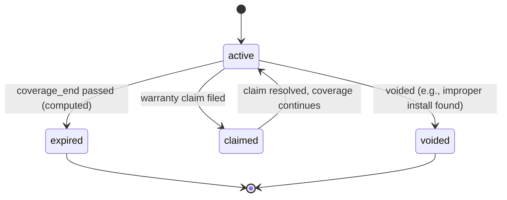

# Warranties

## Purpose

A Warranty is a time-bound coverage record tied to an [Asset](./assets.md), establishing what's covered, by whom (the [Manufacturer](./manufacturers.md) or the Organization itself for labor warranties), and until when. Warranties matter both operationally (should this repair be billed to the customer or claimed?) and as a trust signal in the Property record.

## Key attributes

- `asset_id`, `warranty_type` (`manufacturer_parts`, `manufacturer_labor`, `contractor_labor`, `extended`).
- `manufacturer_id` (nullable — contractor labor warranties have no Manufacturer).
- `coverage_start`, `coverage_end`, `terms_summary`.
- `status` — see State Machine below.
- `registration_reference` (external Manufacturer registration ID, once Phase 5 integrations exist — nullable/manual at launch).

## Relationships

- **Belongs to** one [Asset](./assets.md).
- **References** a [Manufacturer](./manufacturers.md) where applicable.
- **Referenced by** [Jobs](./jobs.md) when a repair is performed under warranty (affects whether the Job's Estimate/Invoice bills the Customer or records a warranty claim instead).

## Business rules

1. A Warranty's `status` is computed as `expired` once `coverage_end` passes, without needing a scheduled job to flip a stored value — displayed status is always derived at read time from `coverage_end` vs. current date, except for `voided`/`claimed` which are explicit actions.
2. Multiple Warranties can apply to the same Asset simultaneously (e.g., manufacturer parts warranty + contractor labor warranty), each independently tracked.
3. At launch, Warranty records are manually entered by staff (from a paperwork/registration card or manufacturer database lookup done outside Atlas); automated registration via Manufacturer APIs is Phase 5 scope — see [Roadmap Phase 5](../13-roadmap/phase-5-manufacturers.md).
4. A Job performed under an active Warranty should reference the Warranty and typically produces a $0 or reduced-cost Invoice (or a warranty claim record) rather than a full-price Invoice — the specific claim/billing interaction is detailed in [Warranties PRD](../06-modules/warranties-prd.md).

## State machine

## Data requirements

`warranties` (`asset_id`, `warranty_type`, `manufacturer_id`, `coverage_start`, `coverage_end`, `terms_summary`, `status` (for the explicit states only — `claimed`/`voided`), `registration_reference`, timestamps).

## Permission requirements

Same visibility as the parent [Asset](./assets.md)/[Property](./properties.md).

## Related documents

[Warranties PRD](../06-modules/warranties-prd.md) · [Assets](./assets.md) · [Manufacturers](./manufacturers.md) · [Compliance](./compliance.md)
