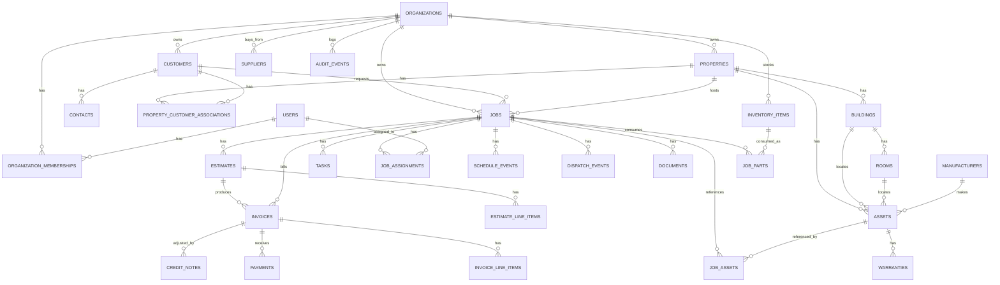

# Entity Relationships

## Purpose

The relational map underlying [Schema Overview](./schema-overview.md), matching the domain hierarchy in [Domain Overview](../03-domain/domain-overview.md).

## Notable relationship design decisions

### Property ↔ Customer is many-to-many over time, not one-to-one

`property_customer_associations` carries `effective_from`/`effective_to` rather than `properties` holding a single `customer_id` — this is the schema-level enforcement of [Properties](../03-domain/properties.md)'s core business rule that Property identity and history survive Customer relationship changes. Any query for "the current Customer of a Property" filters this join table by `effective_to IS NULL`, never reads a denormalized pointer on `properties` itself.

### Job's connections to Assets and Inventory are both join tables, not arrays

`job_assets` and `job_parts` are proper join tables (not Postgres array columns on `jobs`) so they carry their own metadata (`job_parts.quantity`, `unit_cost_at_time`) and participate in normal foreign-key integrity and indexing.

### Financial immutability is a relational, not just an application, guarantee

`invoices` has no foreign key from `credit_notes` implying mutation — `credit_notes` is an additive adjustment table. There is intentionally no `invoice_amendments` table that edits an Invoice's own rows. See [Invoices](../03-domain/invoices.md).

### Manufacturers sit outside the per-Organization tenant graph

`manufacturers` has no `organization_id` and is referenced by `assets` across every Organization — the one deliberate exception to strict per-tenant ownership, justified in [Manufacturers](../03-domain/manufacturers.md).

## Full relationship inventory

For the complete column-level foreign key list, see [Foreign Keys](./foreign-keys.md) and [Schema Overview](./schema-overview.md). This document shows structure and rationale; those two show the literal contract.
