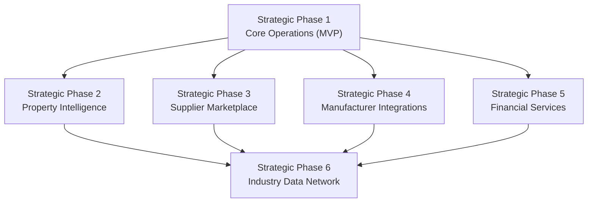
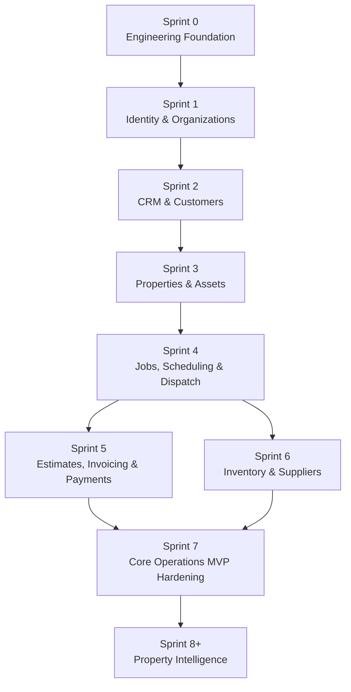

# Roadmap Decision: Strategic Phases vs. Technical Implementation vs. Sprints

## Status

Accepted — this document is the **authoritative resolution** of the roadmap-numbering ambiguity identified in [`DOCUMENTATION-CONSISTENCY-REPORT.md`](../DOCUMENTATION-CONSISTENCY-REPORT.md) (Major Assumptions, item 2). Every other roadmap document in this directory, and every cross-reference to a "Phase" elsewhere in `docs/`, defers to the numbering established here. Where any other document appears to conflict with this one, this document wins and the other document is a documentation bug to be fixed.

## Why this document exists

The original roadmap documentation used the word "Phase" for two different things at once: the six long-term **strategic product pillars** from [Vision](../00-overview/vision.md), and the **sequence of technical build files** in this directory (which also included an engineering-foundation phase that isn't a product pillar at all). That overload made "Phase 3" ambiguous — it could mean either Property Intelligence (a pillar) or Marketplace (a build file), depending which numbering scheme a reader assumed. This document eliminates the overload by giving each concept its own name and its own number.

## A. Strategic Product Phases

These are the six long-term product pillars from [Vision](../00-overview/vision.md). They are business/product milestones, not engineering sprints — a Strategic Phase is "done" when the *capability* is live and delivering value, regardless of how many technical sprints it took. **This numbering is now canonical and does not change based on engineering sequencing.**

| Strategic Phase | Pillar | One-line description |
|---|---|---|
| **Strategic Phase 1** | Core Operations | Scheduling, dispatch, jobs, estimates, invoicing, payments — the operational backbone every field-service business needs on day one. |
| **Strategic Phase 2** | Property Intelligence | Properties, buildings, rooms, and assets as durable records with full service history, enabling predictive maintenance and asset lifecycle insight. |
| **Strategic Phase 3** | Supplier Marketplace | Connecting service businesses to parts suppliers directly inside the workflow. |
| **Strategic Phase 4** | Manufacturer Integrations | Warranty registration, product catalogs, and installation compliance tied to the asset record. |
| **Strategic Phase 5** | Financial Services | Financing for customers, faster payouts for contractors, built on trustworthy job/payment history. |
| **Strategic Phase 6** | Industry Data Network | Aggregate, de-identified equipment lifespan, regional trend, and pricing data benefiting the whole network. |

Strategic Phase 1 (Core Operations) is the **MVP** — see Section E. Strategic Phases 2–6 are all explicitly post-MVP — see Section F.

## B. Technical Implementation Phases

These are the engineering build groupings — the seven files in this directory (`phase-1-foundation.md` through `phase-7-industry-network.md`). **Filenames are unchanged from the original documentation set**; this section defines what they mean going forward and how they map to Section A. Technical Implementation Phase numbering is an engineering sequencing convenience, not a product commitment — it can be resequenced (e.g., Marketplace before Manufacturers) without changing the Strategic Phase numbering above.

| Technical Implementation Phase | File | Implements | Notes |
|---|---|---|---|
| **Technical Phase 1** — Engineering Foundation | [phase-1-foundation.md](./phase-1-foundation.md) | *(no Strategic Phase — pure prerequisite)* | Architecture setup, multi-tenancy, identity, organizations, permissions. Unblocks Strategic Phase 1 but is not itself a product pillar. |
| **Technical Phase 2** — Core Operations Build | [phase-2-core-operations.md](./phase-2-core-operations.md) | Strategic Phase 1 | CRM, Properties/Assets, Jobs/Scheduling/Dispatch, Estimates/Invoicing/Payments, Inventory/Suppliers (basic). |
| **Technical Phase 3** — Property Intelligence Build | [phase-3-property-intelligence.md](./phase-3-property-intelligence.md) | Strategic Phase 2 | |
| **Technical Phase 4** — Supplier Marketplace Build | [phase-4-marketplace.md](./phase-4-marketplace.md) | Strategic Phase 3 | |
| **Technical Phase 5** — Manufacturer Integrations Build | [phase-5-manufacturers.md](./phase-5-manufacturers.md) | Strategic Phase 4 | |
| **Technical Phase 6** — Financial Services Build | [phase-6-financial-services.md](./phase-6-financial-services.md) | Strategic Phase 5 | |
| **Technical Phase 7** — Industry Data Network Build | [phase-7-industry-network.md](./phase-7-industry-network.md) | Strategic Phase 6 | |

**The rule to remember**: Technical Implementation Phase *N* implements Strategic Phase *N − 1*, for N ≥ 2. Technical Phase 1 has no Strategic Phase equivalent — it is pure engineering prerequisite work.

## C. Sprints

Sprints are the granular execution unit within a Technical Implementation Phase. Only Technical Phase 1 and Technical Phase 2 (together, the MVP) are broken into named sprints today; later Technical Phases are deliberately **not** pre-broken into sprints — see [Product Principles](../00-overview/product-principles.md), principle 5, and Section F below.

| Sprint | Focus | Technical Phase | Sprint document |
|---|---|---|---|
| **Sprint 0** | Engineering Foundation — monorepo scaffold, CI/CD, environments, observability | 1 | [sprint-0.md](./sprint-0.md) |
| **Sprint 1** | Identity & Organizations — auth, RBAC, RLS pattern established | 1 | [sprint-1.md](./sprint-1.md) |
| **Sprint 2** | CRM & Customers | 2 | [sprint-2.md](./sprint-2.md) |
| **Sprint 3** | Properties & Assets | 2 | *(planned — see Section C.1)* |
| **Sprint 4** | Jobs, Scheduling & Dispatch | 2 | *(planned — see Section C.1)* |
| **Sprint 5** | Estimates, Invoicing & Payments | 2 | *(planned — see Section C.1)* |
| **Sprint 6** | Inventory & Suppliers | 2 | *(planned — see Section C.1)* |
| **Sprint 7** | Core Operations MVP hardening — cross-module integration testing, security review, performance validation against [Non-Functional Requirements](../01-product/non-functional-requirements.md) | 2 | *(planned — see Section C.1)* |
| **Sprint 8+** | Property Intelligence build | 3 | *(not yet planned — begins only once Sprint 7 exit criteria are met)* |
| **Later** | Supplier Marketplace build | 4 | *(not yet planned)* |
| **Later** | Manufacturer ecosystem build | 5 | *(not yet planned)* |
| **Later** | Financial Services build | 6 | *(not yet planned)* |
| **Later** | Industry Data Network build | 7 | *(not yet planned)* |

No dates are assigned to any sprint. Sprint sequencing is governed entirely by the dependencies and readiness criteria in Section D — a sprint starts when its dependency is met, not on a calendar trigger.

### C.1 Sprint 3–7 scope summary (detailed sprint documents to be authored when each sprint begins)

- **Sprint 3 — Properties & Assets**: `properties`, `property_customer_associations`, `buildings`, `rooms`, `asset_types`, `assets` tables and RLS; Properties/Assets CRUD and service-history endpoints. See [Properties PRD](../06-modules/properties-prd.md), [Assets PRD](../06-modules/assets-prd.md).
- **Sprint 4 — Jobs, Scheduling & Dispatch**: `job_types`, `checklist_templates`, `jobs`, `tasks`, `schedule_events`, `dispatch_events` tables; the Job state machine; the scheduling board; dispatch flow; the Mobile PWA's first end-to-end slice (today's job list, checklist completion). See [Jobs PRD](../06-modules/jobs-prd.md), [Scheduling PRD](../06-modules/scheduling-prd.md), [Dispatch PRD](../06-modules/dispatch-prd.md), [Mobile PRD](../06-modules/mobile-prd.md).
- **Sprint 5 — Estimates, Invoicing & Payments**: the full quote-to-cash flow, Stripe integration, Customer Portal's approval/payment surface. See [Estimates PRD](../06-modules/estimates-prd.md), [Invoicing PRD](../06-modules/invoicing-prd.md), [Payments PRD](../06-modules/payments-prd.md), [Customer Portal PRD](../06-modules/customer-portal-prd.md).
- **Sprint 6 — Inventory & Suppliers**: stock tracking, manual purchase orders, Job-parts consumption. See [Inventory PRD](../06-modules/inventory-prd.md), [Suppliers PRD](../06-modules/suppliers-prd.md). Sprint 6 depends only on Sprint 4 (Jobs), not on Sprint 5 — see Section D.
- **Sprint 7 — Core Operations MVP hardening**: Notifications catalog completion, Analytics/Reporting (basic), QuickBooks integration, full [Security Testing](../09-testing/security-testing.md) checklist, full [User Journeys](../00-overview/user-journeys.md) 1–4 passing end to end in Staging. See [Phase 2: Core Operations](./phase-2-core-operations.md), Exit Criteria.

## D. Dependencies

### Strategic Phase dependencies

Strategic Phases 2, 3, 4, and 5 each depend directly on Strategic Phase 1 being live and proven in production — not merely code-complete (see readiness criteria below) — but do **not** depend on each other, and may be resequenced relative to one another based on actual business/partnership readiness at the time (see [Product Strategy](../01-product/product-strategy.md)). Strategic Phase 6 depends on Phases 2–5 all being substantially mature, since it aggregates data across them, plus its own independent legal/data-rights prerequisite (see Section F).

### Sprint-level dependencies (MVP: Sprints 0–7)

Rationale for each edge:
- **Sprint 0 → Sprint 1**: a working CI/CD/environment pipeline must exist before identity/tenancy code is built against it (see [Sprint 0](./sprint-0.md)).
- **Sprint 1 → Sprint 2**: Customers/Contacts are tenant-owned and Role-gated, so the Membership/RBAC/RLS pattern must exist first (see [Sprint 1](./sprint-1.md)).
- **Sprint 2 → Sprint 3**: a Property's `property_customer_associations` references a Customer (see [Properties](../03-domain/properties.md)).
- **Sprint 2 & Sprint 3 → Sprint 4**: a Job requires a Customer and a Property, and optionally references Assets (see [Jobs](../03-domain/jobs.md), Business Rules).
- **Sprint 4 → Sprint 5**: Estimates and Invoices are generated from Jobs (see [Estimates](../03-domain/estimates.md), [Invoices](../03-domain/invoices.md)).
- **Sprint 4 → Sprint 6**: Inventory consumption (`job_parts`) is recorded against a Job (see [Inventory](../03-domain/inventory.md)); Sprint 6 does **not** depend on Sprint 5, so a larger team can run Sprints 5 and 6 in parallel once Sprint 4 is done.
- **Sprint 5 & Sprint 6 → Sprint 7**: hardening requires the full Core Operations surface to exist.
- **Sprint 7 → Sprint 8+**: see readiness criteria immediately below.

### Readiness criteria for Sprint 7 → Sprint 8+ (Core Operations → Property Intelligence)

Per [Product Strategy](../01-product/product-strategy.md), Sprint 8 (Property Intelligence) does not begin merely because Sprint 7 is code-complete. It begins when:
1. Strategic Phase 1 is live in Production, not just Staging.
2. The Property/Asset-Job-linkage coverage metric from [Success Metrics](../01-product/success-metrics.md) shows real, non-trivial data — an empty or thin dataset makes Property Intelligence worthless to build against.
3. The [Definition of Done](../12-claude/definition-of-done.md) release-level checklist passes for every Sprint 0–7 module.

### Readiness criteria for Strategic Phases 3, 4, 5 (Marketplace, Manufacturers, Financial Services)

Each requires, independently: Strategic Phase 1 live and proven (as above) **and** a credible commercial/partnership prerequisite specific to that phase (a Supplier partnership for Phase 3, a Manufacturer partnership for Phase 4, a financing/payout partner for Phase 5) — see [Business Objectives](../00-overview/business-objectives.md). Engineering readiness alone is not sufficient to begin any of these three.

### Readiness criteria for Strategic Phase 6 (Industry Data Network)

Requires Phases 2–5 substantially mature **and** an explicit, legally-reviewed data-rights and consent framework approved before any implementation work begins — see [Phase 7: Industry Data Network](./phase-7-industry-network.md). This is the single most gated Strategic Phase in the roadmap.

## E. What is required for MVP

**MVP = Strategic Phase 1 (Core Operations) = Sprints 0 through 7.** Nothing from Strategic Phases 2–6 is required for MVP. The MVP includes:

- Identity, Organizations, Teams, RBAC, RLS (Sprint 0–1)
- Customers, Contacts (Sprint 2)
- Properties, Buildings, Rooms, Assets (Sprint 3)
- Jobs, Job Types/checklists, Scheduling, Dispatch, the Mobile PWA (Sprint 4)
- Estimates, Invoicing, Payments (Stripe), the Customer Portal's approval/payment surface (Sprint 5)
- Inventory, Suppliers (basic, manual) (Sprint 6)
- Documents (photo/form capture) — built alongside Sprints 4–5 as the modules that produce them are built
- Notifications (full launch-scope catalog), Analytics/Reporting (basic), QuickBooks Online integration, full security/performance validation (Sprint 7)

This matches [Phase 2: Core Operations](./phase-2-core-operations.md) and [Product Scope](../01-product/product-scope.md) exactly — this document does not change MVP scope, only clarifies its numbering identity as "Strategic Phase 1."

## F. What is explicitly deferred

**All of Strategic Phases 2 through 6** are deferred past MVP, with no engineering work beginning on any of them until their Section D readiness criteria are met:

| Deferred | Strategic Phase | Reason | Detail |
|---|---|---|---|
| Property Intelligence | 2 | Needs real Core Operations data to mine — see readiness criteria above | [phase-3-property-intelligence.md](./phase-3-property-intelligence.md) |
| Supplier Marketplace | 3 | Needs a credible active-Organization base and a Supplier partnership | [phase-4-marketplace.md](./phase-4-marketplace.md) |
| Manufacturer Integrations | 4 | Needs mature Asset/Warranty data and a Manufacturer partnership | [phase-5-manufacturers.md](./phase-5-manufacturers.md) |
| Financial Services | 5 | Needs underwritable job/payment history and a financing/payout partner | [phase-6-financial-services.md](./phase-6-financial-services.md) |
| Industry Data Network | 6 | Needs Phases 2–5 mature and a legal data-rights framework | [phase-7-industry-network.md](./phase-7-industry-network.md) |

Additionally, the following **feature-level** items (not tied to a specific Strategic Phase, or deferred within Strategic Phase 1 itself) remain deferred per [Implementation Backlog](./implementation-backlog.md) and [Product Scope](../01-product/product-scope.md): full offline sync with conflict resolution, custom per-Organization Roles, multi-branch Organizations, native mobile app, SSO/SAML, non-U.S. support, recurring/maintenance-contract Jobs, OCR nameplate capture, two-way SMS, and any AI capability beyond draft-only assistance (see [ADR-020](../11-adr/ADR-020-ai-architecture.md)).

**No infrastructure deferred by the architecture decisions is reconsidered by this document.** Microservices, Kafka, Redis, Elasticsearch, Kubernetes, GraphQL, and any other infrastructure named in [Architecture Principles](../02-architecture/architecture-principles.md) remain out of scope for every Strategic and Technical Phase above unless a future ADR explicitly justifies introducing one — this roadmap decision does not itself constitute such a justification.

## Related documents

[Implementation Roadmap](./implementation-roadmap.md) · [Implementation Backlog](./implementation-backlog.md) · [Vision](../00-overview/vision.md) · [Product Strategy](../01-product/product-strategy.md) · [Product Scope](../01-product/product-scope.md) · [`DOCUMENTATION-CONSISTENCY-REPORT.md`](../DOCUMENTATION-CONSISTENCY-REPORT.md)
