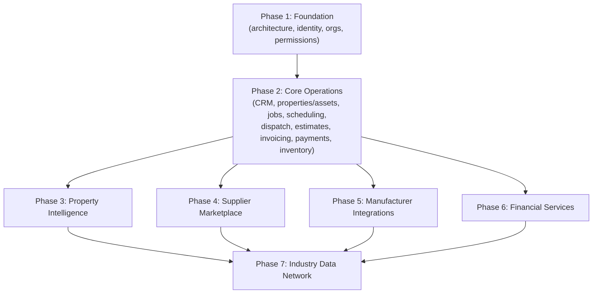

# Implementation Roadmap

## Purpose

The authoritative, phased build plan for Project Atlas, with explicit dependencies. No phase begins in earnest before its dependencies are functionally complete — see [Product Principles](../00-overview/product-principles.md), principle 5, and [Architecture Principles](../02-architecture/architecture-principles.md).

## Roadmap Phases and their mapping to the platform's long-term pillars

Atlas's roadmap is organized into 7 Roadmap Phases (matching the files in this directory), which map onto the 6 long-term platform pillars from [Vision](../00-overview/vision.md), with Phase 1 as the prerequisite foundation underneath all of them:

| Roadmap Phase | File | Long-term pillar | Contains (from the detailed build breakdown) |
|---|---|---|---|
| 1 | [phase-1-foundation.md](./phase-1-foundation.md) | Prerequisite for everything | Architecture setup; Identity, Organizations, Users, Permissions |
| 2 | [phase-2-core-operations.md](./phase-2-core-operations.md) | Pillar 1: Core Operations | CRM/Customers; Properties/Assets; Jobs/Scheduling/Dispatch; Estimates/Invoices/Payments; Inventory/Suppliers |
| 3 | [phase-3-property-intelligence.md](./phase-3-property-intelligence.md) | Pillar 2: Property Intelligence | Deeper asset lifecycle, service-history insight, predictive signals |
| 4 | [phase-4-marketplace.md](./phase-4-marketplace.md) | Pillar 3: Supplier Marketplace | In-workflow Supplier ordering |
| 5 | [phase-5-manufacturers.md](./phase-5-manufacturers.md) | Pillar 4: Manufacturer Integrations | Warranty registration APIs, product compliance data |
| 6 | [phase-6-financial-services.md](./phase-6-financial-services.md) | Pillar 5: Financial Services | Financing, faster payouts |
| 7 | [phase-7-industry-network.md](./phase-7-industry-network.md) | Pillar 6: Industry Data Network | Aggregated, de-identified cross-organization insight |

Roadmap Phase 2 ("Core Operations") intentionally bundles what a more granular breakdown would separate into several numbered phases (CRM, Properties/Assets, Jobs/Scheduling/Dispatch, Estimates/Invoicing/Payments, Inventory/Suppliers) because these are shipped together as one coherent "launch" milestone — see [Product Scope](../01-product/product-scope.md) for why Core Operations is not meaningfully separable into an earlier partial launch.

## Dependency graph

Phases 3–6 each depend directly on Phase 2 being complete, but not on each other — they could in principle be sequenced in a different order among themselves depending on business priority at the time, though the default sequence (Property Intelligence → Marketplace → Manufacturers → Financial Services) follows [Business Objectives](../00-overview/business-objectives.md)'s stated rationale. Phase 7 depends on all of Phases 3–6 since it aggregates data across all of them.

## What "launch" means

Launch = Phase 1 (Foundation) + Phase 2 (Core Operations) complete and in production. Phases 3–7 are explicitly post-launch. See [Roadmap](../00-overview/roadmap.md) for the executive summary and [Product Scope](../01-product/product-scope.md) for exact launch-scope boundaries.

## Early sprints

Phase 1 (and the start of Phase 2) is broken into [Sprint 0](./sprint-0.md), [Sprint 1](./sprint-1.md), and [Sprint 2](./sprint-2.md) for near-term execution planning. Later phases are not yet broken into sprints — that planning happens closer to each phase's start, informed by what was actually learned building the phases before it.

## Backlog

Cross-phase, not-yet-scheduled items are tracked in [Implementation Backlog](./implementation-backlog.md).

## Why this order, restated

See [Product Strategy](../01-product/product-strategy.md) for the full sequencing rationale: Core Operations must be trustworthy before Property Intelligence has data worth mining; Marketplace/Manufacturer partnerships need a credible active-Organization base; Financial Services needs underwritable history; the Industry Data Network is the most compliance-sensitive pillar and is deliberately last.
